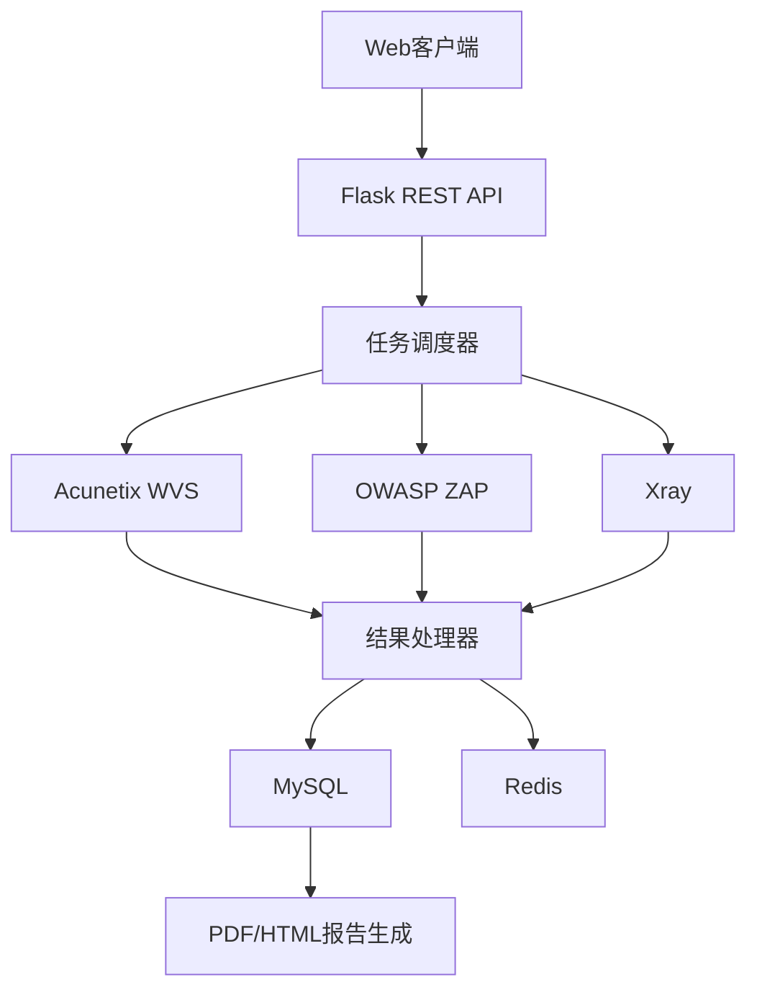

# 在线自动化网络漏洞扫描系统 - 后端

[](https://www.python.org/)

> 毕业设计项目：基于Flask的Web漏洞扫描平台后端服务，整合了多个开源扫描工具，提供统一的漏洞检测和管理功能。

## 项目概述

本系统集成Acunetix WVS、OWASP ZAP和Xray三大扫描引擎，实现：
- 多用户并发漏洞扫描
- 跨工具扫描结果去重
- 自动化报告生成
- JWT认证与权限控制

## 功能特点

- 多工具集成: 支持AWVS、ZAP、Xray等主流扫描工具
- 用户权限管理: 支持多用户、多角色的访问控制
- 任务管理: 支持漏洞扫描任务的创建、监控和管理
- 报告生成: 支持PDF、HTML格式的漏洞报告导出
- 邮件通知: 支持邮件验证和任务通知
- 实时日志: 提供详细的任务执行日志
- API接口: RESTful风格的API设计
  

## 主要功能
- 模块	    功能
- 用户管理	  注册/登录、角色管理、密码重置
- 扫描任务	  任务创建、启动/停止、实时监控
- 漏洞管理	  结果去重、风险分级、修复建议
- 报告系统	  PDF/HTML报告生成
- 告警机制	  邮件通知高危漏洞

## 技术栈

### 核心框架
- **Flask**：轻量级Web框架
- **Celery**：分布式任务队列
- **SQLAlchemy**：ORM数据库管理

### 数据库
- **MySQL**：关系型数据存储
- **Redis**：缓存与消息中间件

### 安全机制
- JWT无状态认证
- CSRF防御
- Scrypt密码哈希

### 扫描引擎集成
- Acunetix WVS (API调用)
- OWASP ZAP (zaproxy库)
- Xray (命令行集成)

## 系统架构

以下为系统整体架构


## 快速开始

> 后端基于Linux发行版Kali编写，使用Windows可能出现问题

1. 克隆项目
```bash
git clone https://github.com/rjcren/vuln_scanner_backend.git
cd vuln_scanner_backend
```

2. 创建虚拟环境
```bash
python -m venv venv
source venv/bin/activate  # Linux
# 或
.\venv\Scripts\activate  # Windows
```

3. 安装依赖
```bash
pip install -r requirements.txt
```

4. 配置环境变量
```bash
cp .env.example .env
# 编辑.env文件，配置必要的环境变量
```

5. 初始化数据库
```bash
flask db upgrade
```

6. 启动服务
```bash
# 开发模式
flask run

# 生产模式
gunicorn -w 4 -b 0.0.0.0:5000 'app:create_app()'
```

## 项目结构

```
vuln_scanner_backend/
├── app/                    # 应用主目录
│   ├── models/            # 数据模型
│   ├── routes/            # API路由
│   ├── services/          # 业务逻辑
│   ├── utils/             # 工具函数
│   └── templates/         # 报告模板
├── instance/              # 实例配置
├── migrations/            # 数据库迁移
├── tests/                 # 测试用例
└── app.py                 # 应用入口
```

## API文档

主要API端点：

- `/api/v1/auth/*`: 认证相关
- `/api/v1/tasks/*`: 任务管理
- `/api/v1/vuls/*`: 漏洞管理
- `/api/v1/reports/*`: 报告管理
- `/api/v1/feedback/*`: 反馈管理

## 许可证

本项目仅用于学习和研究目的，禁止用于商业用途。